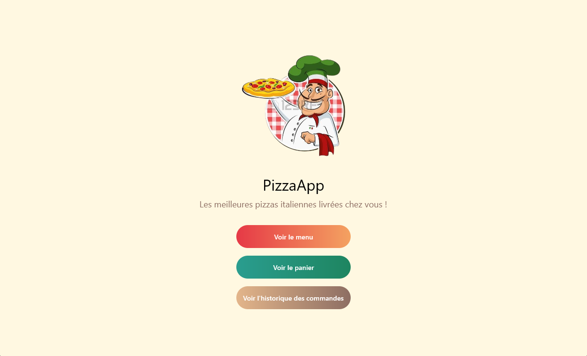

# Projet

## Université Côte d'Azur - DS4H - M2 MIAGE NumRes
### Cours de Programmation Mobile Moderne - Leo Donati

Ce projet est une application multiplateforme, PizzaApp, développée avec Kotlin et Jetpack Compose. Elle cible **Android**, **Desktop** et **Web**, en utilisant des modules spécifiques pour chaque plateforme tout en partageant une partie importante de la logique via le code commun (`commonMain`).

Développé par :
- Siham TABBAA
- Gautier BENOIT
- Arthur PRUDENT

### Vidéo de démonstration (Android, Desktop & Web)
🔗 [Regarder la vidéo sur YouTube](https://youtu.be/GHR2VW8nYTw)

### Technologies et packages utilisés

- **Kotlin Multiplatform** pour le partage de code entre les plateformes.
- **Jetpack Compose** pour la création d'interfaces modernes et réactives.
- **Room** pour la gestion de la persistance des données sur Android.
- **SQLite via JDBC** pour la gestion de la base de données sur Desktop (dépendance `"org.xerial:sqlite-jdbc"`).
- **Ktor** et **Koin** pour la gestion du réseau et l'injection de dépendances respectivement.
- **Compose Desktop** pour la version Desktop, avec des distributions natives configurées dans [build.gradle.kts](composeApp/build.gradle.kts).

### Fonctionnalités

- **Liste des Pizzas** : Affichage dynamique des pizzas disponibles via une interface responsive en utilisant Jetpack Compose.
- **Détail et Personnalisation** : Consultation détaillée de chaque pizza et possibilité d'ajouter des options telles que l'extra fromage.
- **Gestion du Panier** : Ajout des pizzas sélectionnées dans un panier avec mise à jour en temps réel.
- **Navigation Multiplateforme** : Transition fluide entre les écrans sur Android, Desktop et Web.
- **Persistance de Données** : Utilisation de Room sur Android et de SQLite via JDBC sur Desktop pour conserver les informations.

### Difficultés rencontrées et solutions apportées

- **Room** :  
  L'intégration de Room a proposé plusieurs défis.  
  - **Conflits de versions et de manifests** :  
    Lors de la fusion des manifests, certaines dépendances ont provoqué des conflits de versions. Nous avons dû adapter notre configuration Android en ajoutant des directives spécifiques dans le `AndroidManifest.xml` et en utilisant la section `packaging.resources` dans notre configuration Gradle pour exclure ou modifier certains fichiers de ressources.  
  - **Génération de code et annotations** :  
    La génération automatique de code par Room avec KSP a nécessité de veiller à la compatibilité entre les différentes versions du compilateur et du plugin KSP. La gestion des erreurs de compilation a été facilitée par la consultation régulière de la documentation Room et des issues sur GitHub.

- **Multi-plateforme** :  
  La coordination entre les différentes plateformes (Android, Desktop et Web) a été complexe.  
  - **Configurations spécifiques** :  
    Chaque plateforme possède ses propres exigences en termes de ressources et de configurations. Par exemple, l'icône du launcher doit être définie dans le `AndroidManifest.xml` pour Android tandis qu'elle est configurée dans les `nativeDistributions` de [build.gradle.kts](composeApp/build.gradle.kts) pour Desktop.  
  - **Gestion des ressources partagées** :  
    Le partage de code et de ressources via le dossier `commonMain` nécessitait une organisation rigoureuse pour éviter les collisions et pour s'assurer que chaque plateforme a accès aux bonnes ressources au moment de l'exécution.

- **Gestion des dépendances et versions** :  
  Le projet multiplateforme exploite un ensemble varié de bibliothèques, dont Room, Ktor, Koin et Compose Desktop.  
  - **Synchronisation des versions** :  
    La coexistence de plusieurs bibliothèques a impliqué des ajustements fréquents dans le [build.gradle.kts](composeApp/build.gradle.kts) pour aligner les versions et éviter les incompatibilités.  
  - **Résolution de conflits** :  
    Certaines librairies introduisaient des conflits implicites liés à leurs dépendances transitives. L'analyse des rapports de dépendances et l'utilisation judicieuse d'exclusions (via la directive `exclude`) ont permis d'aplanir ces problèmes.

### Lancez le projet
#### Android
Via le bouton run ou la commande `./gradlew installDebug`

#### Desktop
Via le terminal, la commande `./gradlew run`

#### Web
Via le terminal, la commande `./gradlew wasmJsBrowserRun`

